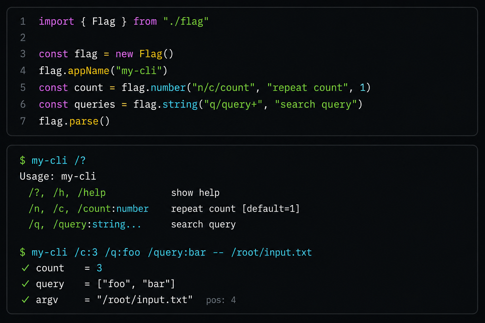

# flag.ts

<p align="center">
  
</p>

A small, typed, unconventional command-line flag parser.

Flags use a `/name:value` syntax. Aliases, multi-value collection, and
automatic help formatting are built in. Every registered flag returns a
reactive `FlagRef<T>` whose `.value` always reflects the latest parse result.

## Inspiration

Go's standard [`flag`](https://pkg.go.dev/flag) package is beautifully minimal
— define flags, parse, use. No decorators, no config objects, just functions
that return pointers. When [tsoding/flag.h](https://github.com/tsoding/flag.h) proved
the same idea works as a single C header, it felt natural to bring it to
TypeScript: **one file, no dependencies, strongly typed.**

The twist is the syntax. Instead of the conventional `--long` / `-s` style,
`flag.ts` uses `/name:value` — closer to Windows and Plan 9 conventions than
Unix. It's unconventional on purpose: a small experiment in what CLI ergonomics
look like when you drop the dashes.

## Install

### 1. Drop-in single file (recommended)

Simply copy [`flag.ts`](./flag.ts) into your project — zero dependencies:

```ts
import { Flag } from './flag'
```

### 2. As a package

```bash
npm install Rishav-Redapple/flag.ts
# or
bun add github:Rishav-Redapple/flag.ts
```

## Quick Start

```ts
import { Flag } from './flag'

const flag = new Flag()
const count = flag.number('count', 'repeat count', 1)
const queries = flag.string('q/query+', 'search queries')

flag.help(`Usage: my-tool [options] [files...]
${flag.usage()}`)

flag.parse() // defaults to process.argv.slice(2)

console.log(count.value, queries.value, flag.argv())
```

```bash
my-tool /count:3 /q:foo /query:bar readme.md
# count.value   → 3
# queries.value → ["foo", "bar"]
# flag.argv()   → [{ pos: 3, value: "readme.md" }]
```

## Flag Syntax

Flags are prefixed with `/` on the command line:

```
/name            boolean flag (presence = true)
/name:value      string or number flag
```

Arguments that don't start with `/` are collected as **positional arguments**.

## Defining Flags

### `flag.bool(name, description, defaultValue?)`

Register a boolean flag. The flag is `true` when present, regardless of any
value passed (e.g. `/help:false` still results in `true`). Defaults to `false`.

### `flag.string(name, description, defaultValue?)`

Register a string flag. Requires a value after the `:` separator. Defaults to `""`.

### `flag.number(name, description, defaultValue?)`

Register a numeric flag. Requires a valid numeric value. Defaults to `0`.

---

Each method returns a `FlagRef<T>` — a read-only object with a `.value` getter
that always reflects the most recent `parse()` result.

## Name Format

Flag names follow this pattern:

```
primary/alias   → one or more aliases separated by /
name+           → collect zero or more values
```

| Name          | Aliases              | Multiple |
| ------------- | -------------------- | -------- |
| `"o"`         | `/o`                 | no       |
| `"h/help"`    | `/h`, `/help`        | no       |
| `"n/c/count"` | `/n`, `/c`, `/count` | no       |
| `"q/query+"`  | `/q`, `/query`       | yes      |

Rules:

- Names must contain only letters, digits, and hyphens (`a-z`, `0-9`, `-`). The `?` character is also strictly allowed for the help flag (`/?`).
- You can provide any number of aliases separated by `/`.
- Duplicate names are rejected.

## Multi-Value Flags

A trailing `+` on the name makes the flag collect values into an array.
Zero or more values are accepted — if none are provided, the value defaults
to `[]`.

```ts
const queries = flag.string('q/query+', 'queries')
flag.parse(['/q:first', '/query:second'])
queries.value // → ["first", "second"]
```

If a default is provided, it is used when no flags are supplied. If flags are supplied, they override the default:

```ts
const queries = flag.string('q/query+', 'queries', 'default')
flag.parse([])
queries.value // → ["default"]
flag.parse(['/q:first'])
queries.value // → ["first"]
```

## Parsing

```ts
flag.parse() // uses process.argv.slice(2)
flag.parse(['/count:5', 'file.txt']) // explicit argv
```

Parsing is **atomic** — if any flag is malformed or unknown, no refs are
updated. This means values from a previous successful parse remain intact.

Calling `parse()` again **resets** all flags to their defaults before applying
the new argv.

## Positional Arguments

Anything that doesn't start with `/` is a positional argument:

```ts
flag.parse(['input.txt', '/verbose', 'output.txt'])
flag.argv()
// → [
//     { pos: 0, value: "input.txt" },
//     { pos: 2, value: "output.txt" }
//   ]
```

Each `PositionalArg` has `pos` (the original index in argv) and `value`.

Use the standard `--` delimiter to stop flag parsing. This is required if you need to pass absolute paths (like `/etc/passwd`) or literal strings starting with `/` as positional arguments:

```bash
my-tool /verbose -- /etc/passwd /tmp/file
```

## Help

By default, `flag.ts` perfectly mimics Go's zero-configuration auto-help.

The flags `/?`, `/h`, and `/help` are automatically registered for you. If a user runs your app with any of those flags, `flag.parse()` intercepts it, automatically prints the generated table, and safely calls `process.exit(0)` without you writing a single line of code!

```bash
$ my-tool /help
Usage: my-tool
  /?, /h, /help         show help
  /count:number         repeat count [default=1]
```

### Overriding Default Output

If you want to customize the layout, simply call `flag.help(template)` before parsing. This overrides the default output:

```ts
flag.help(`Usage: my-tool [options] [files...]
${flag.usage()}`)
```

Use `flag.usage()` inside your template string to inject the formatted, aligned flag table.

_Note: Because template literals are evaluated immediately, always call `flag.help()` after defining all your flags._

## Error Handling

`parse()` throws on:

| Condition      | Example                          |
| -------------- | -------------------------------- |
| Unknown flag   | `/unknown`                       |
| Missing value  | `/count:` or `/count` (non-bool) |
| Invalid number | `/count:abc`                     |

## API Reference

| Export          | Type    | Description                      |
| --------------- | ------- | -------------------------------- |
| `Flag`          | `class` | The flag parser                  |
| `FlagRef<T>`    | `type`  | Read-only ref with `.value: T`   |
| `PositionalArg` | `type`  | `{ pos: number; value: string }` |

## Development

```bash
bun install          # install dependencies
bun run typecheck    # type-check without emitting
bun run build        # compile to dist/
bun test             # run tests
```

## License

MIT
